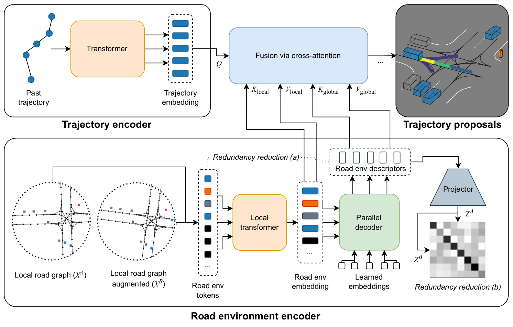

# RedMotion: Motion Prediction via Redundancy Reduction 
TL;DR: Transformer model for motion prediction that incorporates two types of redundancy reduction.

## Overview

**RedMotion model.** Our model consists of two encoders. The trajectory encoder generates an embedding for the past trajectory of the current agent. The road environment encoder generates sets of local and global road environment embeddings as context. All embeddings are fused via cross-attention to yield trajectory proposals per agent.

## Getting started 
[This Colab notebook](https://colab.research.google.com/drive/1Q-Z9VdiqvfPfctNG8oqzPcgm0lP3y1il) shows how to create a dataset, run inference and visualize the predicted trajectories.

## Prepare waymo open motion prediction dataset
Register and download the dataset (version 1.0) from [here](https://waymo.com/open).
Clone [this repo](https://github.com/kbrodt/waymo-motion-prediction-2021) and use the prerender script as described in their readme.

### Acknowledgements
The local attention ([Beltagy et al., 2020](https://arxiv.org/abs/2004.05150)) and cross-attention ([Chen et al., 2021](https://arxiv.org/abs/2103.14899)) implementations are from lucidrain's [vit_pytorch](https://github.com/lucidrains/vit-pytorch) library.
